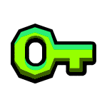

<div align="center">
  
  <h1>🗝️ Limbo Keys 🗝️</h1>
  <p><b>Focus. Memory. Precision.</b></p>
  
  [](https://github.com/asafegamer05-glitch/LimboKeys)
  [](https://github.com/asafegamer05-glitch/LimboKeys)
  [](https://github.com/asafegamer05-glitch/LimboKeys)
</div>

<br>

## 🎮 Sobre o Jogo

**Limbo Keys** é um minigame intenso de memória e rastreamento visual baseado na famosa e aterrorizante mecânica final do nível *"Limbo"* do Geometry Dash. O projeto foi construído do zero focando em **máxima performance** e **baixo consumo de hardware**, projetado para rodar até em máquinas mais modestas sem nenhum engasgo!

<details>
<summary><b>✨ Clique aqui para ver a Lore do Jogo!</b></summary>
Você é desafiado pelo Limbo. 8 chaves aparecerão. Apenas uma é verde. Elas vão embaralhar na sua frente em uma dança hipnótica. Quando a música mandar, você tem poucos segundos para escolher a correta. Se errar... você já sabe o que acontece. 💀
</details>

---

## ⚡ Diferenciais desta Versão

🚀 **Ultra-Leve:** Diferente das builds convencionais de Electron que pesam mais de 200MB, nosso projeto inteiro tem apenas alguns MBs.  
👻 **Silent Launch:** O jogo inicia diretamente, sem aquelas janelas pretas chatas de terminal (CMD) abrindo no fundo.  
🧠 **Otimização Extrema:** Código 100% focado em processamento lógico eficiente, sem engines de terceiros atrapalhando o FPS.  
🎭 **Dificuldades Customizadas:** Jogue desde o *Easy* até o *Extreme Demon*, ou explore as chaves e segredos ocultos do jogo!

---

## 🤫 Códigos Secretos

Cansado das dificuldades normais? No menu principal, clique no botão **OPÇÕES** e digite um dos códigos abaixo para acessar os Modos Secretos:

| Código | Dificuldade | O que acontece? |
| :---: | :--- | :--- |
| 🛡️ `123` | **Modo Passeio** | As chaves nem sequer se movem! Perfeito pra quem só quer ganhar e ouvir a música de vitória. |
| 🔥 `666` | **Pesadelo** | Uma velocidade diabólica, mais rápida que o *Extreme Demon*. Você vai precisar de reflexos absurdos. |
| 💀 `67` | **Impossível** | A velocidade da luz. As chaves piscam pela tela como se estivessem se teletransportando. Boa sorte (você vai precisar). |

---

## 💻 Pré-requisitos e Instalação

Para rodar essa maravilha, você só precisa do **Node.js** na sua máquina.

1. **Baixe o Node.js:** [Clique aqui para a versão recomendada (LTS)](https://nodejs.org/dist/v20.12.2/node-v20.12.2-x64.msi)
2. **Clone ou Baixe o Repositório:** Extraia no seu PC.
3. (Opcional) Abra o terminal na pasta e instale as dependências:
   ```bash
   npm install
   ```
4. **Jogue!** Basta rodar no terminal com `npm start` ou usar o atalho script pra abrir direto, e mergulhar no Limbo.

---

## 🛠️ Stack Tecnológica

<div align="center">
  
  
  
  
</div>

- **Scripting:** VBScript (para execução oculta).
- **Engine Core:** Sistema customizado de geometria para simulação de física e Swap de janelas em tempo real!

---

<div align="center">
  <h3>"Focus." 🗝️🔑🔑🔑🔑🔑🔑🔑</h3>
  <i>Desenvolvido com muita dor, sofrimento e café por Asaf.</i>
</div>